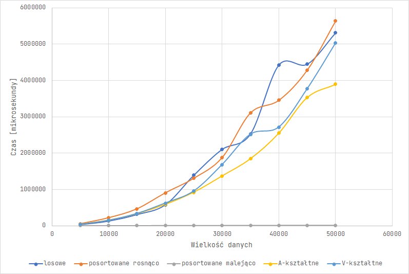
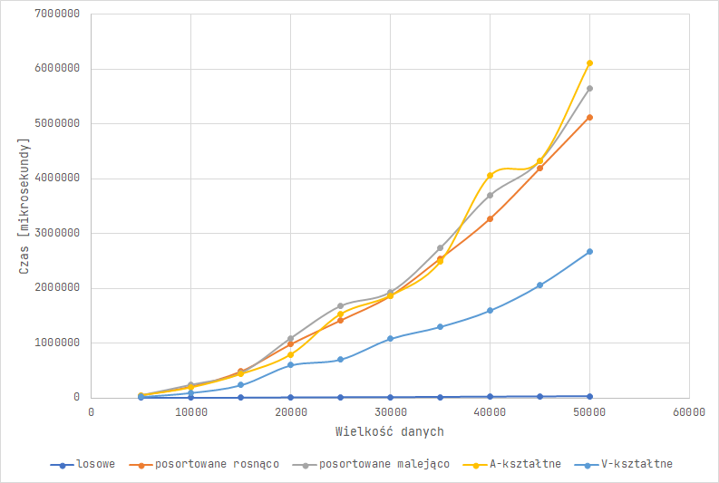
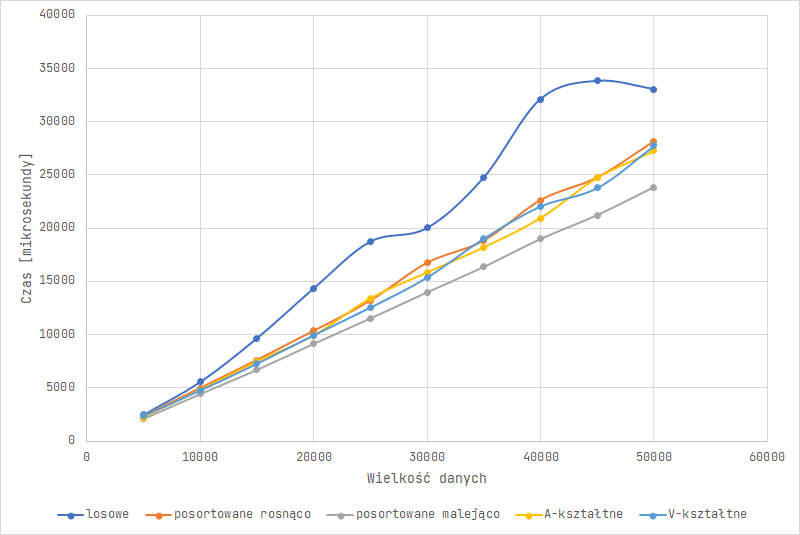
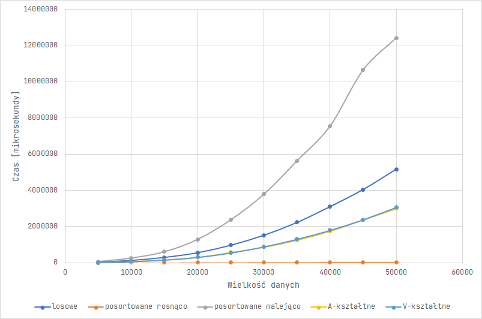
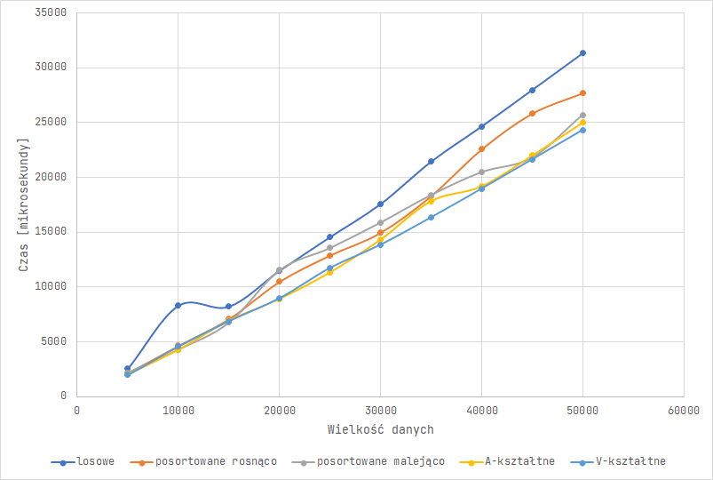
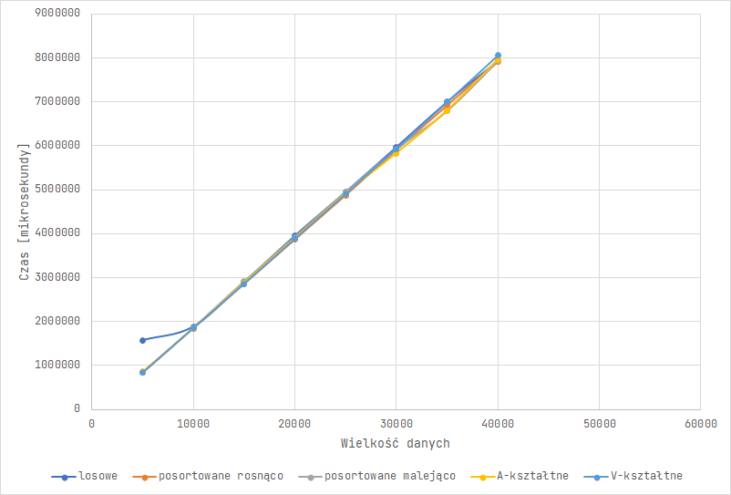
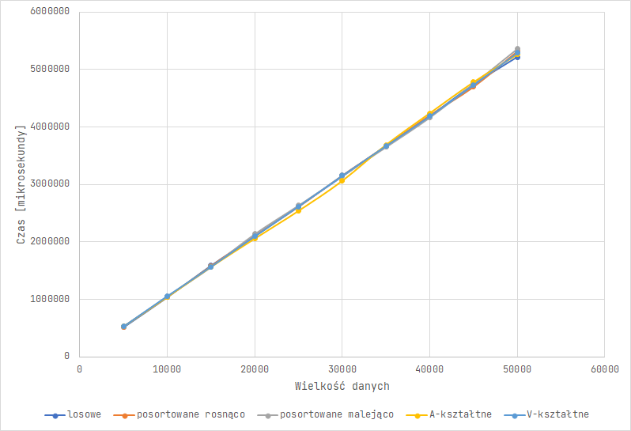
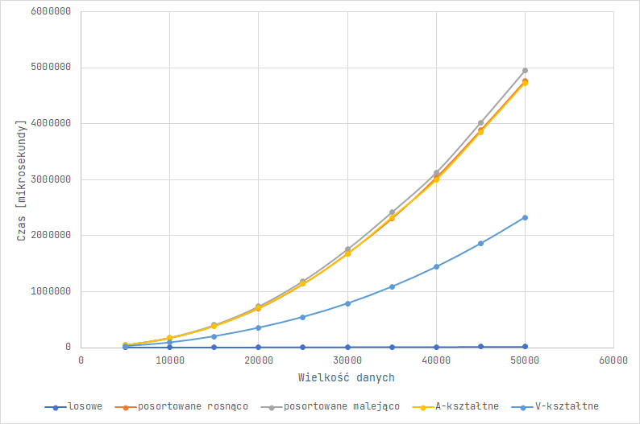

Algorytmy i struktury danych. Sprawozdanie – Złożone struktury danych

## Mariusz Hybiak, Informatyka, nr albumu 148117

# 1 Złożone struktury danych

Celem laboratoriów była implementacja struktur danych takich jak lista jednokierunkowa, binarne drzewo poszukiwań (ang. Binary Search Tree, BST) oraz drzewo AVL (nazwa pochodzi od nazwisk matematyków Adelsona-Velskiego oraz Landisa).

## 1.1 Testowanie

Kody wymienionych wyżej struktur opracowywałem w języku C++. Czas działania każdych operacji sprawdzam na danych o dziesięciu różnych wielkościach: od 5000 do 50000. Każda wielkość ma reprezentację w postaci danychh losowych, posortowanych rosnąco, posortowanych malejąco oraz V-kształtnych i A-kształtnych. Test wykonuję 4 razy i biorę średnią z wszystkich otrzymanych wyników. Do mierzenia czasu używam funkcji biblioteki `chrono` przedstawionych poniżej:

```cpp
    auto start = chrono::steady_clock::now();
    auto stop = chrono::steady_clock::now();
    auto duration = chrono::duration_cast<chrono::microseconds>(stop - start);
    long long time_result = duration.count();
```

Opracowywane przeze mnie kody znajdują się w [repozytorium GitHub](https://github.com/majsterkovic/aisd/tree/main/aisd-data).

# 2 Implementacje – opis i trudności

## 2.1 Lista jednokierunkowa

Lista jednokierunkowa była najprostszą do zaimplementowania strukturą danych. Należało stworzyć strukturę węzła, a następnie łączyć takie węzły przy pomocy wskaźników na następny węzeł. Procedury przeszukiwania, a także wypisywania elementów można realizować liniowo oraz rekurencyjnie. W mojej implementacji zastosowałem wariant iteracyjny, ponieważ taka struktura będzie mieć w porównaniu do innych największą "długość" i przy takich danych metoda rekurencyjna mogłaby doprowadzić do przepełnienia stosu. Kluczem do najlepszej implementacji listy jednokierunkowej była dla mnie nauka wskaźników, ale także podwójnych wskaźników, które pozwalają, by nie rozpatrywać osobno głowy listy i całej reszty. Aby upodobnić strukturę do pozostałych, zaimplementowana przeze mnie lista jednokierunkowa przechowuje elementy posortowane.

## 2.2 Binarne drzewo przeszukiwań

Binarne drzewo przeszukiwań opiera się na tym, że każdy węzeł wskazuje na dwa kolejne – lewe i prawe poddrzewo. Elementy są kierowane na tej zasadzie, że w lewym poddrzewie znajdują się wartości mniejsze od tej w węźle, a w prawym większe. Trudnością w implementacji okazało się dla mnie początkowo napisanie procedury usuwania. Jeśli usuwany element ma dwójkę dzieci (wskazuje na dwa poddrzewa) to należy zamienić go w tym miejscu na największy element z lewego poddrzewa, a węzeł zawierający wspomniany element usunąć. Procedura ta odbędzie się maksymalnie raz, ponieważ najmniejszy element może mieć maksymalnie jedno, prawe dziecko. Moje binarne drzewo przeszukiwań wypisuje elementy metodą rekurencyjną, ale sprawdza czy istnieje dany element metodą iteracyjną.

## 2.3 Drzewo AVL

Drzewo AVL to szczególny wariant drzewa BST, który stara się zachować najbardziej optymalny kształt struktury. W tym celu w każdym węźle przechowywany jest także współczynnik wyważenia, który po dodaniu lub usunięciu elementu należy przeliczyć na nowo. Jednym z rozwiązań tego problemu jest przechowywanie w każdym węźle również adresu rodzica. Można jednak posłużyć się kolekcjonowaniem adresów odwiedzanych elementów do listy, aby następnie poruszać się po niej od końca i ustawiać współczynnik wyważenia. Takie rozwiązanie zabiera jednak dodatkową pamięć w trakcie wykonania. Można by także od nowa obliczać współczynniki dla całego drzewa, ale wtedy wykonywałoby się zdecydowanie więcej instrukcji, więc jest to sposób wysoce nieefektywny. Dużym wyzwaniem przy implementacji drzewa AVL jest dla mnie prawidłowe napisanie mechanizmu rotacji, należy szczególnie uważać, aby w czasie rotowanie nie odwoływać się do węzła, który nie istnieje. Jeśli chodzi o pozostałe funkcje, są one identyczne jak w przypadku mojego binarnego drzewa przeszukiwań.

# 3 Porównanie operacji

## 3.1 Wstawianie elementów

### 3.1.1 Lista jednokierunkowa

Można zauważyć, że lista kierunkowa najlepiej poradziła sobie z danymi posortowanymi malejąco. Jest to efekt tego, że każda kolejna wartość była wstawiana na początek listy. W opozycji do tego stoją dane posortowane rosnąco, gdzie czas dodawanie elementów był zdecydowanie najdłuższy już na starcie. Da się jednak zauważyć, że wraz ze wzrostem ilości danych, czasy dla poszczególnych typów danych wyglądają różnie, jednak rosną one w szybszym niż liniowe tempie.

|     | losowe | posortowane rosnąco | posortowane malejąco | A-kształtne | V-kształtne |
| --- | --- | --- | --- | --- | --- |
| 5000 | 34767 | 54171 | 1039 | 37145 | 37591 |
| 10000 | 132914 | 218944 | 2157 | 150197 | 146381 |
| 15000 | 312865 | 464227 | 3268 | 328672 | 335407 |
| 20000 | 579946 | 904372 | 4382 | 586129 | 623347 |
| 25000 | 1391382 | 1304483 | 5466 | 920443 | 953709 |
| 30000 | 2106095 | 1873839 | 6627 | 1370071 | 1682371 |
| 35000 | 2529200 | 3104606 | 7698 | 1844763 | 2518150 |
| 40000 | 4430863 | 3454638 | 8784 | 2551298 | 2716762 |
| 45000 | 4452993 | 4285762 | 9955 | 3534045 | 3773715 |
| 50000 | 5313010 | 5636018 | 11062 | 3894688 | 5032877 |



### 3.1.2 Binarne drzewo przeszukiwań

Binarne drzewo przeszukiwań nie poradziło sobie dobrze ani z danymi posortowanymi malejąco, ani z danymi posortowanymi rosnąco. Powodem tego jest fakt, że w tych przypadkach w rzeczywistości była budowana lista jednokierunkowa w prawo lub w lewo. Podobnie drzewo BST zachowało się dla danych A-kształtnych budując najpierw gałąź w jedną stronę, a następnie do tej gałęzi budując odnogę w drugą. Optymistycznymi przypadkami okazały się być dane V-kształtne i losowe, w przypadku pierwszych program budował w drzewie dwie odnogi o równej długości. Mając jednak podane dane losowe, elementy były rozmieszczane bardziej równomiernie, większa liczba węzłów ma dwójkę dzieci, przez co drzewo ma mniejszą wysokość i szybciej jest dodawać elementy na koniec. Tempo wzrostu jest szybsze niż liniowe.

|     | losowe | posortowane rosnąco | posortowane malejąco | A-kształtne | V-kształtne |
| --- | --- | --- | --- | --- | --- |
| 5000 | 1965 | 47888 | 49788 | 47855 | 24639 |
| 10000 | 3524 | 205341 | 241258 | 192015 | 98174 |
| 15000 | 5488 | 481811 | 457449 | 437217 | 239248 |
| 20000 | 8820 | 977010 | 1091372 | 794402 | 598827 |
| 25000 | 11158 | 1411239 | 1678374 | 1532227 | 705586 |
| 30000 | 13249 | 1857714 | 1931829 | 1868801 | 1081685 |
| 35000 | 16038 | 2538453 | 2736287 | 2483543 | 1300390 |
| 40000 | 19422 | 3265138 | 3698846 | 4055798 | 1596849 |
| 45000 | 22165 | 4184391 | 4320857 | 4331954 | 2058186 |
| 50000 | 26126 | 5123901 | 5641180 | 6107415 | 2667517 |



### 3.1.3 Drzewo AVL

W przypadku drzewa AVL mamy zbliżone wyniki dla każdego rodzaju danych, jest to spowodowane tym, że dla każdego rodzaju danych algorytm budował strukturę o podobnej wysokości stosując rotacje. Udało się w ten sposób osiągnąć czasy podobne do dodawania losowych danych do BST. Nie są one jednak identyczne, ponieważ rotowanie gałęzi i obliczanie współczynnika wyważenia również zajmuje czas.

|     | losowe | posortowane rosnąco | posortowane malejąco | A-kształtne | V-kształtne |
| --- | --- | --- | --- | --- | --- |
| 5000 | 2479 | 2333 | 2096 | 2216 | 2361 |
| 10000 | 5559 | 4972 | 4424 | 4770 | 4754 |
| 15000 | 9657 | 7609 | 6699 | 7447 | 7263 |
| 20000 | 14337 | 10348 | 9140 | 9887 | 9949 |
| 25000 | 18739 | 13188 | 11524 | 13387 | 12556 |
| 30000 | 20022 | 16748 | 13969 | 15833 | 15379 |
| 35000 | 24761 | 18834 | 16361 | 18195 | 19040 |
| 40000 | 32123 | 22640 | 18982 | 20942 | 22070 |
| 45000 | 33818 | 24788 | 21228 | 24739 | 23803 |
| 50000 | 33060 | 28179 | 23839 | 27245 | 27748 |



## 3.2 Usuwanie elementów

### 3.2.1 Lista jednokierunkowa

Usuwanie elementów biorąc je z danych posortowanych rosnąco było najszybsze, ze względu na to, że te element znajdują się na początku listy. Odwrotna sytuacja nastąpiła biorąc pod uwagę usuwanie elementów z końca listy (dane posortowane malejąco), dlatego czasy tej operacji są nieporównywalnie większe. Usuwane dane A- oraz V-kształtne wypadły na podobnym poziomie i był to poziom lepszy niż usuwanie losowych elementów.

|     | losowe | posortowane rosnąco | posortowane malejąco | A-kształtne | V-kształtne |
| --- | --- | --- | --- | --- | --- |
| 5000 | 31933 | 979 | 63855 | 16900 | 18133 |
| 10000 | 128595 | 1981 | 261231 | 67733 | 70892 |
| 15000 | 293586 | 3054 | 607584 | 161748 | 160807 |
| 20000 | 552431 | 4037 | 1293288 | 305053 | 307806 |
| 25000 | 967325 | 5227 | 2372823 | 575914 | 548300 |
| 30000 | 1515082 | 6488 | 3786179 | 865549 | 887836 |
| 35000 | 2223613 | 7369 | 5628709 | 1255501 | 1303168 |
| 40000 | 3095519 | 8926 | 7557116 | 1749867 | 1796318 |
| 45000 | 4042679 | 9664 | 10656703 | 2363819 | 2381935 |
| 50000 | 5165225 | 10523 | 12427463 | 2985010 | 3063554 |



### 3.2.2 Binarne drzewo przeszukiwań

W przypadku binarnego drzewa poszukiwań obieranie elementów do usunięcia w różnym porządku, poza danymi losowymi nie przyniosło znaczącej różnicy.

|     | losowe | posortowane rosnąco | posortowane malejąco | A-kształtne | V-kształtne |
| --- | --- | --- | --- | --- | --- |
| 5000 | 1782 | 1175 | 1460 | 1197 | 1328 |
| 10000 | 5081 | 2551 | 2554 | 2453 | 2984 |
| 15000 | 7253 | 3719 | 3715 | 3988 | 4090 |
| 20000 | 8671 | 5887 | 5098 | 6552 | 6070 |
| 25000 | 10677 | 6583 | 6511 | 7043 | 8579 |
| 30000 | 13531 | 7783 | 7793 | 8532 | 10154 |
| 35000 | 15878 | 9019 | 9499 | 9905 | 10830 |
| 40000 | 18109 | 11670 | 11172 | 13418 | 11693 |
| 45000 | 20137 | 12531 | 13232 | 14210 | 13564 |
| 50000 | 24610 | 13286 | 17655 | 15537 | 14874 |
| 45000 | 20137 | 12531 | 13232 | 14210 | 13564 |
| 50000 | 24610 | 13286 | 17655 | 15537 | 14874 |


### 3.2.3 Drzewo AVL

Podobnie jak w poprzednim wypadku zachowało się drzewo AVL, wnioski są analogiczne.

|     | losowe | posortowane rosnąco | posortowane malejąco | A-kształtne | V-kształtne |
| --- | --- | --- | --- | --- | --- |
| 5000 | 2530 | 2140 | 2186 | 2026 | 1955 |
| 10000 | 8292 | 4633 | 4284 | 4281 | 4566 |
| 15000 | 8209 | 7079 | 6743 | 6939 | 6894 |
| 20000 | 11475 | 10488 | 11528 | 8926 | 8978 |
| 25000 | 14551 | 12889 | 13556 | 11343 | 11743 |
| 30000 | 17570 | 14961 | 15885 | 14331 | 13862 |
| 35000 | 21438 | 18307 | 18393 | 17846 | 16352 |
| 40000 | 24652 | 22560 | 20488 | 19197 | 18968 |
| 45000 | 27981 | 25838 | 21801 | 21994 | 21635 |
| 50000 | 31328 | 27702 | 25720 | 25004 | 24315 |



## 3.3 Wypisywanie elementów - odwiedzanie wszystkich

### 3.3.1 Lista jednokierunkowa

Czasy wypisywania są tutaj praktycznie identyczne, ponieważ w każdym przypadku lista wygląda tak samo. Czas trwania rośnie liniowo wraz ze wzrostem długości listy.

|     | losowe | posortowane rosnąco | posortowane malejąco | A-kształtne | V-kształtne |
| --- | --- | --- | --- | --- | --- |
| 5000 | 837349 | 841539 | 829995 | 834015 | 847399 |
| 10000 | 1840091 | 1846883 | 1847137 | 1849091 | 1851540 |
| 15000 | 2856858 | 2840546 | 2833631 | 2862996 | 2866972 |
| 20000 | 3818462 | 3831805 | 3872241 | 3894967 | 3875092 |
| 25000 | 4880145 | 4922070 | 4860137 | 4879067 | 4855937 |
| 30000 | 5858426 | 5893561 | 5849504 | 5900540 | 5861006 |
| 35000 | 6839854 | 6913437 | 6877934 | 6896019 | 6861992 |
| 40000 | 7870177 | 7867939 | 7870148 | 7921462 | 7873794 |
| 45000 | 8847595 | 8827957 | 8902124 | 9058783 | 8877655 |
| 50000 | 9902826 | 9900516 | 9921697 | 10007677 | 9879046 |


### 3.3.2 Binarne drzewo przeszukiwań

Wypisywanie wszystkich elementów w porządku rosnącym trwa zbliżony czas dla każdego z typów danych. Wzrost czasów trwania ma charakter liniowy.

|     | losowe | posortowane rosnąco | posortowane malejąco | A-kształtne | V-kształtne |
| --- | --- | --- | --- | --- | --- |
| 5000 | 1568970 | 830852 | 831705 | 854910 | 835360 |
| 10000 | 1878084 | 1843786 | 1853742 | 1850589 | 1850943 |
| 15000 | 2891361 | 2853920 | 2913583 | 2881452 | 2857917 |
| 20000 | 3948119 | 3865433 | 3920130 | 3899613 | 3881231 |
| 25000 | 4944357 | 4873118 | 4941175 | 4913760 | 4900730 |
| 30000 | 5969586 | 5900910 | 5922695 | 5829552 | 5930889 |
| 35000 | 7000437 | 6917549 | 6791692 | 6801566 | 6991657 |
| 40000 | 7930989 | 7905010 | 7930429 | 7958939 | 8051211 |
| 45000 | -   | -   | -   | -   | -   |
| 50000 | -   | -   | -   | -   | -   |



### 3.3.3 Drzewo AVL

Dla drzewa AVL wypisywanie trwa tyle samo, niezależnie od tego w jakiej kolejności dodawaliśmy dane. Wzrost czasu trwania jest liniowy.

|     | losowe | posortowane rosnąco | posortowane malejąco | A-kształtne | V-kształtne |
| --- | --- | --- | --- | --- | --- |
| 5000 | 516245 | 522846 | 526472 | 526815 | 527563 |
| 10000 | 1038807 | 1040477 | 1047204 | 1041791 | 1058081 |
| 15000 | 1589455 | 1575985 | 1561106 | 1566191 | 1569109 |
| 20000 | 2095632 | 2108044 | 2136211 | 2057896 | 2098843 |
| 25000 | 2623784 | 2608019 | 2632610 | 2540752 | 2615404 |
| 30000 | 3139621 | 3153175 | 3143239 | 3062950 | 3153194 |
| 35000 | 3674776 | 3667981 | 3648568 | 3689584 | 3668387 |
| 40000 | 4188350 | 4202486 | 4163878 | 4239675 | 4186373 |
| 45000 | 4740142 | 4696153 | 4749762 | 4780029 | 4727028 |
| 50000 | 5215650 | 5314056 | 5356978 | 5258978 | 5288003 |



## 3.4 Znajdowanie elementu

### 3.4.1 Lista jednokierunkowa

Z racji tego, że wyszukiwanie odbywa się za każdym razem na finalnie identycznej liście, czasy są bardzo zbliżone. Jest tutaj jednak wzrost szybszy niż liniowy.

|     | losowe | posortowane rosnąco | posortowane malejąco | A-kształtne | V-kształtne |
| --- | --- | --- | --- | --- | --- |
| 5000 | 61448 | 61562 | 61472 | 60577 | 60371 |
| 10000 | 274751 | 277874 | 280820 | 276373 | 274927 |
| 15000 | 701361 | 689657 | 707082 | 697552 | 697662 |
| 20000 | 1581407 | 1546155 | 1576481 | 1576561 | 1556319 |
| 25000 | 2857540 | 2832517 | 2852045 | 2855683 | 2942718 |
| 30000 | 4485509 | 4438174 | 4421076 | 4463365 | 4456935 |
| 35000 | 6413961 | 6327192 | 6393509 | 6351246 | 6376264 |
| 40000 | 8654933 | 8552172 | 8604114 | 8625522 | 10450231 |
| 45000 | 11366659 | 11159857 | 11250677 | 11174577 | 12966335 |
| 50000 | 14164413 | 14240677 | 14150608 | 14914655 | 15020664 |


### 3.4.2 Binarne drzewo przeszukiwań

Wyniki wyglądają podobnie jak przy dodawaniu elementów do binarnego drzewa poszukiwań. Najszybsze okazało się znajdywanie danych w BST utworzonym z losowo ułożonych danych, a następnie z V-kształtnych danych. Tempo wzrostu jest szybsze niż liniowe.

|     | losowe | posortowane rosnąco | posortowane malejąco | A-kształtne | V-kształtne |
| --- | --- | --- | --- | --- | --- |
| 5000 | 1350 | 43182 | 44837 | 43928 | 22360 |
| 10000 | 2946 | 171574 | 180070 | 173740 | 88421 |
| 15000 | 4589 | 390651 | 404329 | 388763 | 199641 |
| 20000 | 6279 | 703708 | 737721 | 709298 | 352621 |
| 25000 | 8086 | 1137033 | 1190914 | 1141592 | 545048 |
| 30000 | 10716 | 1681667 | 1758889 | 1673769 | 786495 |
| 35000 | 11919 | 2307834 | 2419977 | 2326994 | 1086288 |
| 40000 | 13616 | 3039525 | 3129210 | 2997469 | 1440467 |
| 45000 | 16345 | 3883825 | 4021816 | 3849447 | 1856259 |
| 50000 | 18799 | 4764853 | 4952125 | 4727475 | 2324796 |



### 3.4.3 Drzewo AVL

Tutaj również wyniki wyglądają podobnie jak przy wstawianiu danych do struktury. Czas działania algorytmu rośnie liniowo wraz ze wzrostem instancji danych, a najgorzej AVL radzi sobie z danymi losowymi.

|     | losowe | posortowane rosnąco | posortowane malejąco | A-kształtne | V-kształtne |
| --- | --- | --- | --- | --- | --- |
| 5000 | 1152 | 1004 | 999 | 1009 | 1005 |
| 10000 | 2529 | 2074 | 2098 | 2084 | 2076 |
| 15000 | 3864 | 3165 | 3231 | 3171 | 3174 |
| 20000 | 5236 | 4306 | 4337 | 4260 | 4275 |
| 25000 | 6690 | 5373 | 5466 | 5374 | 5531 |
| 30000 | 8128 | 6571 | 6620 | 6566 | 6533 |
| 35000 | 9637 | 7621 | 7735 | 7702 | 7662 |
| 40000 | 11074 | 8833 | 8929 | 8945 | 8874 |
| 45000 | 12624 | 10030 | 10023 | 10029 | 9993 |
| 50000 | 14230 | 11227 | 11296 | 11102 | 11153 |


# 4 Porównanie struktur

Dla porównania poszczególnych struktur zestawiłem czasy otrzymane dla najmniejszych oraz największych danych.

## 4.1 Wstawianie elementów

|     | losowe | posortowane rosnąco | posortowane malejąco | A-kształtne | V-kształtne |
| --- | --- | --- | --- | --- | --- |
| lista jednokierunkowa | 34767 | 54171 | 1039 | 37145 | 37591 |
| BST | 1965 | 47888 | 49788 | 47855 | 24639 |
| AVL | 2479 | 2333 | 2096 | 2216 | 2361 |
| lista jednokierunkowa | 5313010 | 5636018 | 11062 | 3894688 | 5032877 |
| BST | 26126 | 5123901 | 5641180 | 6107415 | 2667517 |
| AVL | 33060 | 28179 | 23839 | 27245 | 27748 |

Ze wstawianiem elementów najlepiej poradziło sobie drzewo AVL, binarne drzewo przeszukiwań ma natomiast niski wynik jedynie dla danych wstawianych w porządku losowym. Co ciekawe, wyprzedza ono wtedy drzewo AVL. Jest to spowodowane tym, że w drzewie AVL dodatkowy czas jest przeznaczany na rotacje i propagację współczynnika wyważenia.

## 4.2 Usuwanie elementów

|     | losowe | posortowane rosnąco | posortowane malejąco | A-kształtne | V-kształtne |
| --- | --- | --- | --- | --- | --- |
| lista jednokierunkowa | 31933 | 979 | 63855 | 16900 | 18133 |
| BST | 1782 | 1175 | 1460 | 1197 | 1328 |
| AVL | 2530 | 2140 | 2186 | 2026 | 1955 |
| lista jednokierunkowa | 5165225 | 10523 | 12427463 | 2985010 | 3063554 |
| BST | 24610 | 13286 | 17655 | 15537 | 14874 |
| AVL | 31328 | 27702 | 25720 | 25004 | 24315 |

Operacja usuwania elementów przebiega, nawet dla mniejszych instancji danych, szybciej w przypadku drzewa BST niż AVL. Myślę, że jest to ponownie spowodowane rotacjami i obliczaniem współczynnika wyważenia.

## 4.3 Wypisywanie elementów - odwiedzanie wszystkich

|     | losowe | posortowane rosnąco | posortowane malejąco | A-kształtne | V-kształtne |
| --- | --- | --- | --- | --- | --- |
| lista jednokierunkowa | 837349 | 841539 | 829995 | 834015 | 847399 |
| BST | 1568970 | 830852 | 831705 | 854910 | 835360 |
| AVL | 516245 | 522846 | 526472 | 526815 | 527563 |
| lista jednokierunkowa | 9902826 | 9900516 | 9921697 | 10007677 | 9879046 |
| *BST* | *7930989* | *7905010* | *7930429* | *7958939* | 8051211 |
| AVL | 5215650 | 5314056 | 5356978 | 5258978 | 5288003 |

Jeśli chodzi o odwiedzanie wszystkich elementów i ich wypisywanie, ujawniła się tutaj jedna ze słabości binarnego drzewa poszukiwań. Przez to, że poddrzewa nie były rotowane i mają większą wysokość niż w przypadku drzewa AVL potrzeba więcej wywołań rekurencji, by dostać się do liści. Uruchomiony program kończył sie błędem `0xC00000FD`, czyli przepełnieniem stosu, dlatego w tabeli znalazły się maksymalne wartości dla danych o wielkości 40000, a nie 50000. Mimo tego, struktura BST nie wyprzedza drzewa AVL, a raczej zbliża się czasem działania do listy jednokierunkowej. Jeśli chodzi o małe dane, tutaj zwycięzcą jest drzewo AVL, a lista jednokierunkowa jest szybsza od BST. Sądzę, że jest to spowodowane iteracyjnym podejściem do wypisywania z niej elementów.

## 4.4 Znajdowanie elementu

|     | losowe | posortowane rosnąco | posortowane malejąco | A-kształtne | V-kształtne |
| --- | --- | --- | --- | --- | --- |
| lista jednokierunkowa | 61448 | 61562 | 61472 | 60577 | 60371 |
| BST | 1350 | 43182 | 44837 | 43928 | 22360 |
| AVL | 1152 | 1004 | 999 | 1009 | 1005 |
| lista jednokierunkowa | 14164413 | 14240677 | 14150608 | 14914655 | 15020664 |
| BST | 18799 | 4764853 | 4952125 | 4727475 | 2324796 |
| AVL | 14230 | 11227 | 11296 | 11102 | 11153 |

Szukanie elementu pokazuje, że drzewo AVL, mniejsze jak i większe, działa znacząco szybciej niż BST czy lista jednokierunkowa. Niemniej jednak binarne drzewo przeszukiwań również dość dobrze spełnia swoją funkcję i czasu szukania elementtu są zauważalnie mniejsze niż na liście jednokierunkowej. Co więcej, jeśli do BST dodaje się losowe elementy drzewo zdaje się zachowywać balans, ponieważ czas działania bardzo zbliża się do AVL.

# 5 Podsumowanie

Jak pokazały testy, najefektywniejszą strukturą okazało się być drzewo AVL. Działa ono sumarycznie najszybciej dla większych, jak i mniejszych wielkości zgromadzonych danych. Co prawda dodawanie elementów trwa tam nieco dłużej niż w BST, ale według mnie to, ile czasu trwa przeszukiwanie drzewa AVL rekompensuje ten fakt. Na wykresach da się też zauważyć, że czasy dla drzewa AVl najczęściej rosną tak jak funkcja liniowa, więc jest to też najbardziej bezpieczna i przewidywalna pod tym względem struktura danych. Jedynie dla dodawanych danych losowych binarne drzewo przeszukiwań osiąga zadowalające czasy działania. Nie mamy jednak nigdy pewności jak ułożą się nasze dane losowe i myślę, że w specyficznych przypadkach nawet tutaj drzewo BST mogłoby zawieść.
Można zwrócić uwagę na fakt, że rekurencyjne podejście do wypisywania elementów nie działa w przypadku zbyt dużych drzew, iteracyjnie obsługiwana lista nie ma tego problemu.
Wszystkie trzy struktury charakteryzują się użytecznością, ponieważ pozwalają na przechowywanie nieograniczonej początkowo liczby elementów. Co więcej, w każdej z nich jest prosty dostęp do najmniejszej i największej przechowywanej wartości.
Gdyby lista jednokierunkowa nie musiała gromadzić posortowanych danych, można by ją usprawnić poprzez zapamiętywanie końca (ogona). Wtedy czas dodawania nowych elementów byłby stały i niezależny od długości listy.